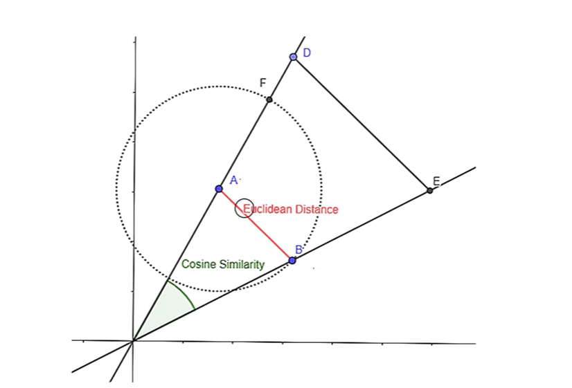
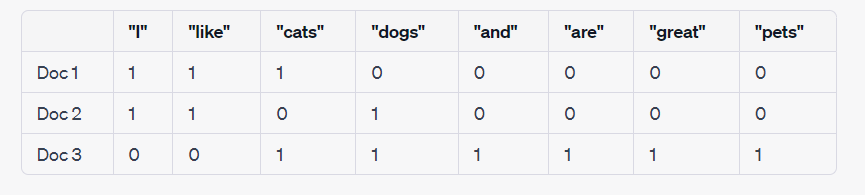
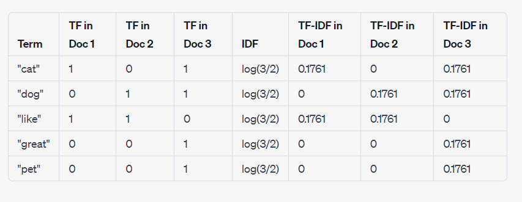

# Contents
1. Simple Recommender Systems
2. Association Rule Learning
3. Content Based Filtering
4. Colaborative Filtering

# 1. Association Rule Learning 
Association rule learning is a machine learning technique used to uncover interesting and often hidden relationships, dependencies, or patterns in large datasets. It is primarily applied in the field of data mining and is particularly useful for identifying associations between items or events within a dataset. 

The fundamental concept behind association rule learning is to analyze the frequency and co-occurrence of items in transactions or records to generate rules of the form "if A, then B," where A and B are sets of items or events.

These rules are typically quantified using metrics such as support and confidence. Support measures the frequency with which a rule is applicable, while confidence gauges the likelihood that the rule is true, given the presence of its antecedent (A). Association rule learning is widely used in various domains, including market basket analysis in retail, recommendation systems, web usage mining, and fraud detection, to uncover valuable insights and inform decision-making processes.

Popular algorithms are : AIS, SETM, Apriori... 

Best one is: Apriori.

## 1.1 Apriori Alghorithm

The Apriori algorithm is a classic and fundamental algorithm used in association rule learning and frequent itemset mining. Its primary purpose is to discover frequent itemsets within a dataset and generate association rules based on these itemsets.

**Support Threshold**: The algorithm starts by defining a minimum support threshold, which is a user-specified parameter. Support measures how frequently an itemset (a set of items) appears in the dataset. Itemsets that meet or exceed this support threshold are considered frequent itemsets.

**Generating Candidate Itemsets**: The algorithm begins with individual items as the initial itemsets. These itemsets are considered 1-item frequent itemsets. Then, it iteratively generates higher-sized candidate itemsets (2-item, 3-item, and so on) by joining pairs of frequent itemsets from the previous iteration.

**Pruning**: After generating candidate itemsets, the algorithm prunes those that are not likely to be frequent. This pruning step is based on the "Apriori property," which states that any subset of a frequent itemset must also be frequent. In other words, if an itemset is infrequent, all its supersets will also be infrequent.

**Counting Support**: The algorithm scans the dataset to count the support of each candidate itemset, i.e., it counts how many times each candidate itemset appears in the dataset.

**Filtering**: Candidate itemsets whose support is below the user-defined minimum support threshold are eliminated, leaving only frequent itemsets.

**Association Rule Generation** : Once frequent itemsets are found, the Apriori algorithm can generate association rules. These rules are typically of the form "if A, then B," where A and B are sets of items. Confidence and support metrics are used to assess the strength and significance of these rules.

- Support(X, Y) is a measure of how often the combination of items in X and Y appears together in the dataset.
```
Support(X,Y) = Freq(X,Y)/N
```

- Confidence(X,Y) represents the probability that itemset Y will be found in a transaction when itemset X is also present in that transaction.

```
Confidence(X,Y) = Freq(X,Y)/Freq(X)
```

- Lift is a measure of how much more likely itemset Y is to be purchased or observed when itemset X is present, compared to what would be expected if X and Y were statistically independent.

```
Lift = Support(X,Y)/Support(X)*Support(Y)
```

# 2. Content Based Filtering

## 2.1 Vector Represantions of words

Methods:
- Count Vector (Word Count)
- TF-IDF (Text Vectorization)

Calculation principles:
- Euclidean Distance!
- Cosine Similarity!




### 2.1.1 Count Vector

"Count vector" typically refers to a numerical representation of the content or features of items (such as articles, products, or movies) in a recommendation system. This vector represents the presence or frequency of specific attributes, keywords, or characteristics associated with each item. Each dimension in the vector corresponds to a unique attribute, and the value in each dimension represents the count of how many times that attribute appears in the item's content.

For example, in a content-based movie recommendation system, the count vector for a movie might include dimensions like "action," "romance," "comedy," and "director." Each dimension would be assigned a count based on the presence or frequency of relevant keywords or features in the movie's description. This count vector can be used to quantitatively measure the content similarity between items.

Content-based filtering leverages these count vectors to make recommendations. When a user expresses their preferences or provides information about items they like, the system can compare the user's preferences (expressed as a similar count vector) to the count vectors of available items. The system then recommends items whose count vectors are most similar to the user's preferences, as this indicates a content-based match.

Document 1: "I like cats."

Document 2: "I like dogs."

Document 3: "Dogs and cats are great pets."



### 2.1.2 TF-DF


TF-IDF stands for "Term Frequency-Inverse Document Frequency." It is a numerical statistic used in information retrieval, text mining, and natural language processing to evaluate the importance of a term (word or phrase) within a document relative to a collection of documents (a corpus). TF-IDF is commonly used for tasks like text classification, document ranking, and content-based recommendation systems.

Here's a brief explanation of the two components of TF-IDF:

**Term Frequency (TF)**: This component measures how frequently a term appears in a document. It is calculated as the ratio of the number of times a term occurs in a document to the total number of terms in the document. The idea is to give higher weight to terms that appear more frequently within a document. The formula for term frequency is:
```
TF(t, d) = (Number of times term t appears in document d) / (Total number of terms in document d)
```

**Inverse Document Frequency (IDF)**: This component measures the importance of a term in the entire corpus by penalizing terms that are common across many documents. It is calculated as the logarithm of the total number of documents in the corpus divided by the number of documents containing the term, and then the result is inverted. The formula for inverse document frequency is:
```
IDF(t) = log((Total number of documents in the corpus) / (Number of documents containing term t))
```

The TF-IDF score for a term in a document is the product of its Term Frequency (TF) and Inverse Document Frequency (IDF). This score reflects how important a term is within a specific document while considering its importance in the entire corpus:

```
TF-IDF(t, d) = TF(t, d) * IDF(t)
```

Key points to note about TF-IDF:

- Terms that appear frequently in a specific document but are rare in the overall corpus receive high TF-IDF scores, suggesting they are important for that document.
- Terms that are common across many documents in the corpus receive low TF-IDF scores, indicating they are less discriminative.
- TF-IDF is used for tasks like document ranking (e.g., in search engines), text classification (e.g., spam detection), and content-based recommendation systems (e.g., suggesting articles or products to users based on their interests).
- TF-IDF can be used to convert a collection of documents into a numerical representation, which can then be used for various machine learning and natural language processing tasks.

Document 1: "I like cats."

Document 2: "I like dogs."

Document 3: "Dogs and cats are great pets."




